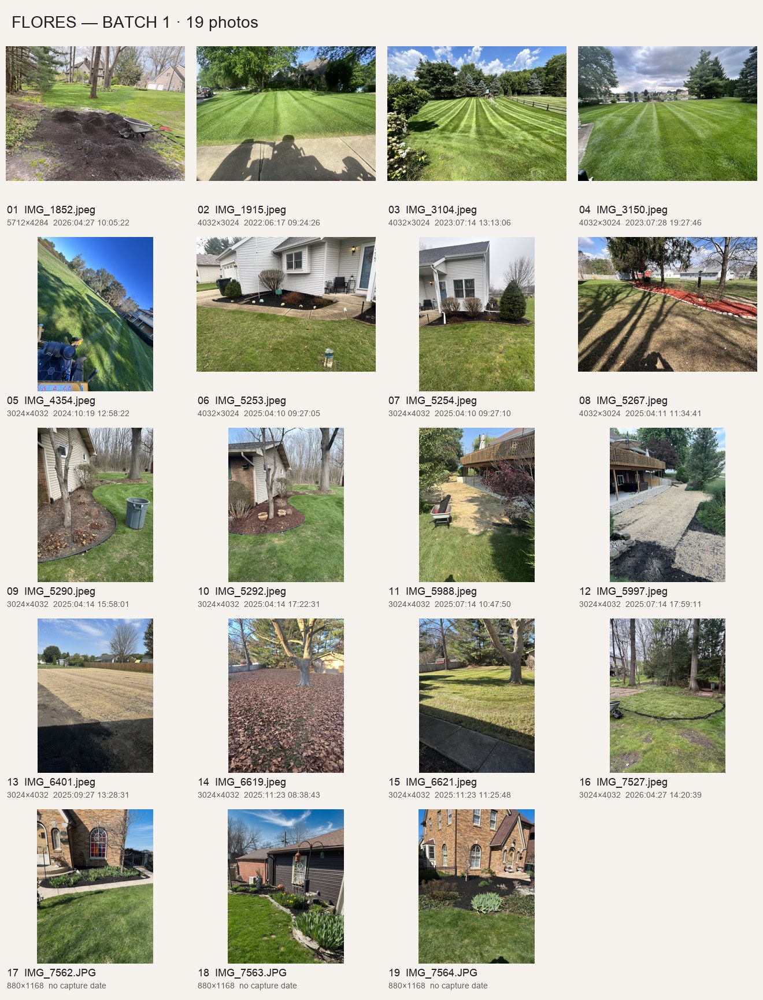
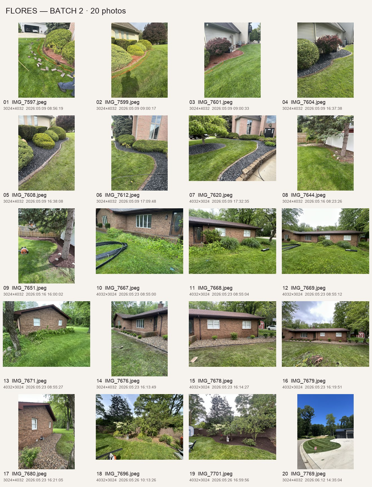
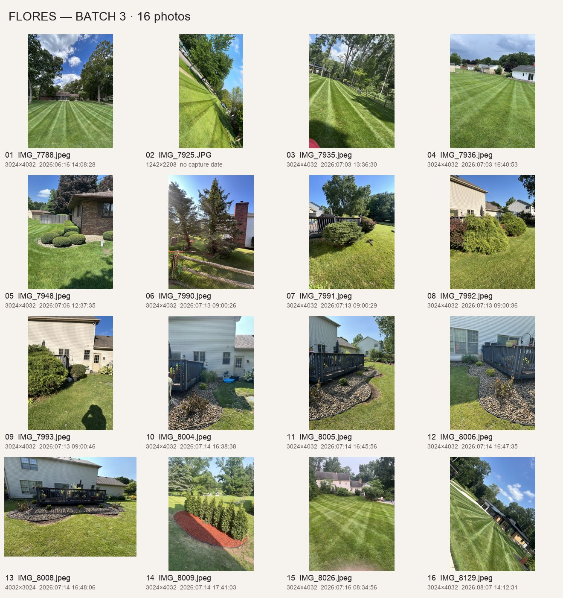
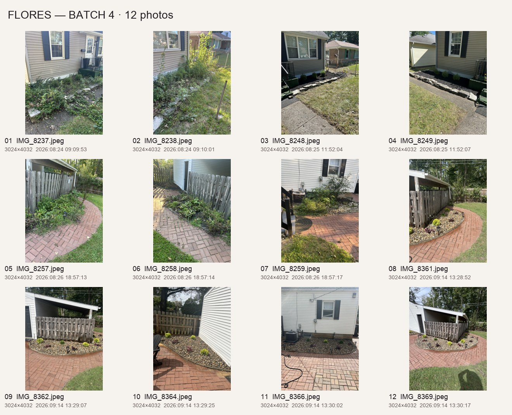
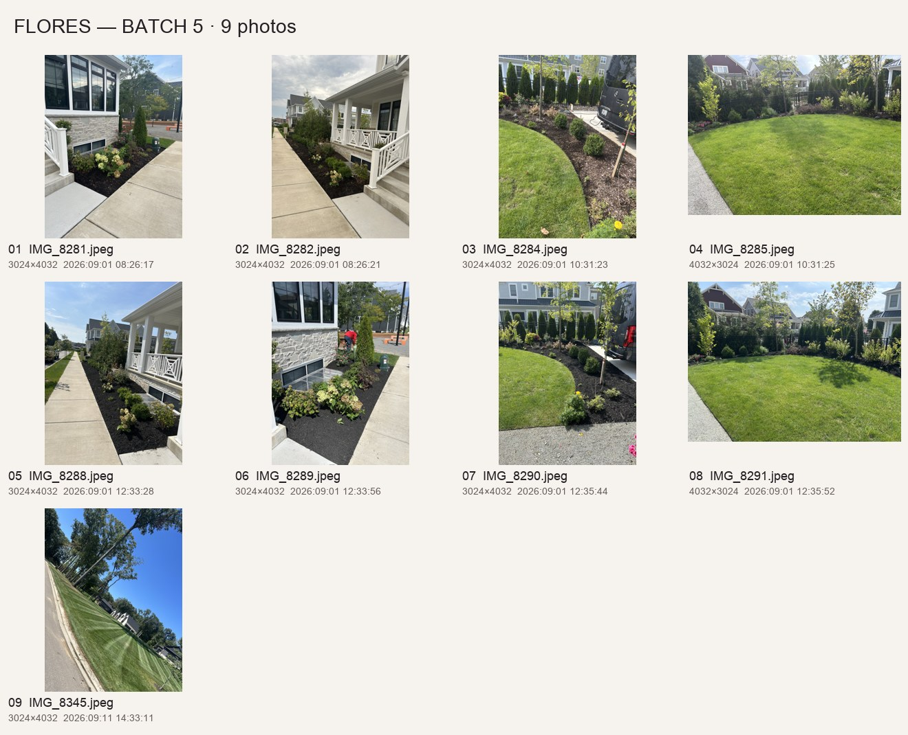
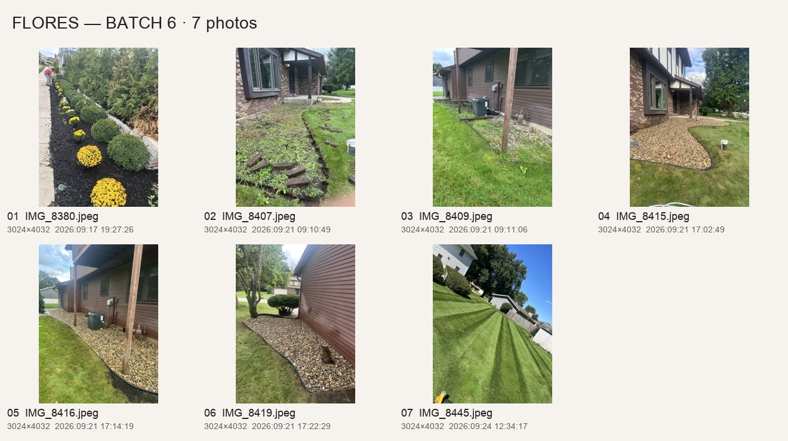

# Flores photo review — September 25, 2026

Reviewed all **83 photos in six batches**. The original Desktop folders were not renamed, edited, or moved. No videos were included in these batches.

**39 unique source photos currently selected:** 12 for six comparisons (three on the homepage and three different projects on Our Work), nine gallery images, and 18 other source photos for page imagery. Two of those 39 replace the existing collage with its original photos. The finished spring-bed photo also appears in its Services overview preview, and IMG_8289 appears in About and Contact; desktop/mobile versions share the same source. The separately supplied homepage Lawn Care card photo is tracked in `docs/image-sources.json`.

Matching used visible buildings, windows, fences, paving, trees and bed outlines, supported by capture times where present. Capture metadata supports a sequence but is not independent proof of project dates. Camera positions differ: comparisons are not geometrically registered and the full-photo viewer preserves both original frames. No AI retouching or invented results were used.

Web copies were oriented and resized to a maximum 2,200-pixel edge, with metadata stripped. Astro generates responsive WebP outputs; originals stay untouched. `placements.json` records source filenames, checksums and destinations. The catalog and inspection sheets live under `docs/`, not the public website.

The lower Sod Installation, Spring & Fall Cleanup, and Trimming sections now use the three approved standalone photos (IMG_1852, IMG_8369, IMG_7612). On September 26, the client selected IMG_7992 → IMG_8008 for the third homepage comparison. Both exact requested photos were found in Batch 3; the after image reuses `src/assets/backyard.jpg`.

The Services overview hero now uses the client-confirmed finished mulch photo IMG_8291, replacing the earlier IMG_8285 view on September 26.

The Services overview previews for Sod Installation and Spring & Fall Cleanup reuse the existing completed sod photo and IMG_5292 respectively. No duplicate files were imported. Their homepage cards and standalone hero/detail photos were already present.

Contact now uses the client-selected finished mulch view IMG_8289, reusing the existing About photo. The previous IMG_8281 is reserved as a client-confirmed before view.

## Before-and-after selections

| Placement | Project | Before → after | Evidence |
| --- | --- | --- | --- |
| Homepage | Front stone beds | IMG_7669 → IMG_7679 | Same brick home, windows and roofline; these are the original collage photos. |
| Homepage | Leaf cleanup | IMG_6619 → IMG_6621 | Same forked tree, shed and rear fence; leaves cleared. |
| Homepage | Deck garden | IMG_7992 → IMG_8008 | Client-selected views of the same deck, siding, windows and umbrella; large shrubs replaced with small plants in stone beds. |
| Our Work | Evergreen border | IMG_7644 → IMG_7651 | Same evergreen, fence junction and rocks; fresh mulch and edge. |
| Our Work | Backyard border | IMG_7696 → IMG_7701 | Same fence, small trees and garden statue; overgrowth cleared and mulched. |
| Our Work | Brick path | IMG_8257 → IMG_8361 | Same curved paving, wooden enclosure and roof; stone bed and plants. |

## Duplicates and alternates

There are no byte-identical or full-resolution pixel-identical files among the 83. Visual inspection was necessary because existing website copies were resized/re-encoded. IMG_7620 matches `landscape-beds.jpg`, IMG_7608 matches `stone-edging.jpg`, and IMG_8008 matches `backyard.jpg`; these were not imported again. The existing `backyard.jpg` is now reused in the third homepage comparison. IMG_7669/7679 replace the existing collage in its existing slot. IMG_3104 is a nearby alternate view of the lawn already in `lawn-stripes.jpg`, and was reserved.

## Items to confirm or save for later

- **IMG_1852 / IMG_7527:** same-day preparation/turf images, but opposite views do not conclusively establish the exact area. Do not publish as a pair without confirmation.
- **IMG_5988 / IMG_5997 and IMG_6401:** straw-covered ground / work in progress. Do not claim these show a finished sod lawn.
- **IMG_7990:** no matching after found. Do not infer tree removal.
- **Batch 5:** likely mulch refreshes, but the earlier beds are already maintained. Use standalone shots; confirm scope before making before/after claims.
- **Batch 6 IMG_8407/8409:** work had already started. Their matches are preparation-to-finish sequences, not untouched before photos.
- **Remaining genuine pairs:** spring bed (5290/5292), deck (7991/8005), additional front-bed and path-bed angles are recorded below. Kept out of duplicate comparison cards to avoid showing the same property repeatedly.
- A clear **family/team portrait**, **snow-plowing photos**, and snow-service detail shots are still needed. A distant person working appears in the About story; it is not labeled as a particular family member. The separately supplied eight videos are now on Our Work; this photo review covers only the six image batches.

## All batches

The table accounts for every file, including reserved photos. See `index.html` for a visual review, `review.json` for machine-readable notes, and `placements.json` for the source-to-site mapping.

### Batch 1

| File | Assessment | Placement | Notes |
| --- | --- | --- | --- |
| IMG_1852.jpeg | Standalone / pairing unconfirmed | Sod installation detail | Approved as a standalone ground-preparation image for the lower sod-service section. Shows loose soil, a wheelbarrow, and tools; not labeled as a verified sod installation or as the before image for IMG_7527. The exact relationship between those two views remains unconfirmed. |
| IMG_1915.jpeg | Standalone | Services lawn preview | Finished mowing view; no verified before photo. Choose for lawn care, not sod installation claims. |
| IMG_3104.jpeg | Existing-project alternate | Reserved — not added to website | Same lawn scene as existing lawn-stripes.jpg, photographed from a nearby position. Retain as an alternative; do not add another near-duplicate. |
| IMG_3150.jpeg | Standalone | Gallery | Finished mowing view; no verified before photo. Choose for lawn care, not sod installation claims. |
| IMG_4354.jpeg | Reserve / tilted framing | Reserved — not added to website | Completed mowing, with strong camera tilt or distracting foreground. Better upright selections are available. No before/after evidence. |
| IMG_5253.jpeg | Standalone / alternate views | Gallery | Same completed front garden from two angles. Not a before/after pair. Use IMG_5253; reserve IMG_5254. |
| IMG_5254.jpeg | Standalone / alternate views | Reserved — not added to website | Same completed front garden from two angles. Not a before/after pair. Use IMG_5253; reserve IMG_5254. |
| IMG_5267.jpeg | Standalone | Gallery | Finished long mulch border; no matching before photo found. |
| IMG_5290.jpeg | Strong pair / reserve comparison | Reserved — not added to website | Same twin-trunk tree, wall vent, small window, edging, and large background tree. Same-day capture sequence; sparse/debris-strewn bed becomes freshly mulched. Angles differ. IMG_5292 used as a seasonal service photo, so the pair is reserved to avoid repetition. |
| IMG_5292.jpeg | Strong pair / reserve comparison | Seasonal cleanup hero and Services preview | Same twin-trunk tree, wall vent, small window, edging, and large background tree. Same-day capture sequence; sparse/debris-strewn bed becomes freshly mulched. Angles differ. IMG_5292 used as a seasonal service photo, so the pair is reserved to avoid repetition. September 26: also reused for the Services overview preview on desktop and mobile; no duplicate asset imported. |
| IMG_5988.jpeg | Progress sequence / reserve | Reserved — not added to website | Same elevated deck, string lights, railings and walkout. Different ends of the site; stone edging and straw-covered ground visible later. Not a finished green-lawn after shot; do not label as sod without confirmation. |
| IMG_5997.jpeg | Progress sequence / reserve | Reserved — not added to website | Same elevated deck, string lights, railings and walkout. Different ends of the site; stone edging and straw-covered ground visible later. Not a finished green-lawn after shot; do not label as sod without confirmation. |
| IMG_6401.jpeg | Needs confirmation | Reserved — not added to website | Broad straw-covered yard. No verified green-lawn counterpart; method and completed outcome cannot be inferred from this image. |
| IMG_6619.jpeg | Strong pair | Homepage comparison | Same forked tree, shed, rear fence and distant red roof. Leaf-covered lawn becomes clear; same-day timestamps support sequence. Camera shifts slightly. |
| IMG_6621.jpeg | Strong pair | Homepage comparison | Same forked tree, shed, rear fence and distant red roof. Leaf-covered lawn becomes clear; same-day timestamps support sequence. Camera shifts slightly. |
| IMG_7527.jpeg | Standalone / work in progress | Sod installation hero | Visible newly laid turf patch and equipment. Useful for sod service; not paired with IMG_1852 until matching area is confirmed. Do not present as a completed whole-property project. |
| IMG_7562.JPG | Standalone / alternate views | Gallery | Matching brick building and arched windows, two finished angles. Lower-resolution exports. Use IMG_7562 at card size; keep IMG_7564 as alternate. |
| IMG_7563.JPG | Standalone reserve | Reserved — not added to website | Finished narrow planting bed beside an outbuilding. No matching before view; relationship to adjacent brick-building images is not proven. |
| IMG_7564.JPG | Standalone / alternate views | Reserved — not added to website | Matching brick building and arched windows, two finished angles. Lower-resolution exports. Use IMG_7562 at card size; keep IMG_7564 as alternate. |

### Batch 2

| File | Assessment | Placement | Notes |
| --- | --- | --- | --- |
| IMG_7597.jpeg | Strong project sequence / existing coverage | Reserved — not added to website | Same rounded shrubs, house walls and sweeping bed edges. Early pictures show layout marking/loose edging and red mulch; later pictures show stone and borders. IMG_7599→7608 and IMG_7601→7604 are the clearest area matches. Work has already begun in IMG_7597. Existing site already covers this project. |
| IMG_7599.jpeg | Strong project sequence / existing coverage | Reserved — not added to website | Same rounded shrubs, house walls and sweeping bed edges. Early pictures show layout marking/loose edging and red mulch; later pictures show stone and borders. IMG_7599→7608 and IMG_7601→7604 are the clearest area matches. Work has already begun in IMG_7597. Existing site already covers this project. |
| IMG_7601.jpeg | Strong project sequence / existing coverage | Reserved — not added to website | Same rounded shrubs, house walls and sweeping bed edges. Early pictures show layout marking/loose edging and red mulch; later pictures show stone and borders. IMG_7599→7608 and IMG_7601→7604 are the clearest area matches. Work has already begun in IMG_7597. Existing site already covers this project. |
| IMG_7604.jpeg | Strong project sequence / existing coverage | Services trimming preview | Same rounded shrubs, house walls and sweeping bed edges. Early pictures show layout marking/loose edging and red mulch; later pictures show stone and borders. IMG_7599→7608 and IMG_7601→7604 are the clearest area matches. Work has already begun in IMG_7597. Existing site already covers this project. |
| IMG_7608.jpeg | Existing image duplicate | Reserved — not added to website | Visually the same photograph as stone-edging.jpg at a different size/encoding. Do not import again. |
| IMG_7612.jpeg | Standalone detail / existing project alternate | Trimming detail | Approved as a standalone shrub detail for the lower trimming section. Shows shaped shrubs beside a brick home. Other photographs from this property remain in their existing placements; this source was previously unused. |
| IMG_7620.jpeg | Existing image duplicate | Reserved — not added to website | Visually the same photograph as landscape-beds.jpg at a different size/encoding. Do not import again. |
| IMG_7644.jpeg | Strong pair | Our Work comparison | Same evergreen trunk, white/wood fence junction, shrub and scattered rocks. Ground cover refreshed into a curved mulch bed. Same-day capture sequence; slight change in position. |
| IMG_7651.jpeg | Strong pair | Our Work comparison | Same evergreen trunk, white/wood fence junction, shrub and scattered rocks. Ground cover refreshed into a curved mulch bed. Same-day capture sequence; slight change in position. |
| IMG_7667.jpeg | Strong project sequence | Reserved — not added to website | Brick walls, window layout, front door and roofline identify one project. Overgrown beds become stone with small spaced shrubs. IMG_7669→7679 is the existing homepage collage; IMG_7671→7680 is an additional side-wall match. Retain extra angles rather than making multiple cards for one property. |
| IMG_7668.jpeg | Strong project sequence | Reserved — not added to website | Brick walls, window layout, front door and roofline identify one project. Overgrown beds become stone with small spaced shrubs. IMG_7669→7679 is the existing homepage collage; IMG_7671→7680 is an additional side-wall match. Retain extra angles rather than making multiple cards for one property. |
| IMG_7669.jpeg | Existing collage originals / replacement | Homepage comparison | These are the two original photographs already combined in front-yard-before-after.webp. Use sharper separate images in that existing comparison, not a second copy of the project. |
| IMG_7671.jpeg | Strong project sequence | Reserved — not added to website | Brick walls, window layout, front door and roofline identify one project. Overgrown beds become stone with small spaced shrubs. IMG_7669→7679 is the existing homepage collage; IMG_7671→7680 is an additional side-wall match. Retain extra angles rather than making multiple cards for one property. |
| IMG_7676.jpeg | Strong project sequence | Reserved — not added to website | Brick walls, window layout, front door and roofline identify one project. Overgrown beds become stone with small spaced shrubs. IMG_7669→7679 is the existing homepage collage; IMG_7671→7680 is an additional side-wall match. Retain extra angles rather than making multiple cards for one property. |
| IMG_7678.jpeg | Strong project sequence | Services landscaping preview | Brick walls, window layout, front door and roofline identify one project. Overgrown beds become stone with small spaced shrubs. IMG_7669→7679 is the existing homepage collage; IMG_7671→7680 is an additional side-wall match. Retain extra angles rather than making multiple cards for one property. |
| IMG_7679.jpeg | Existing collage originals / replacement | Homepage comparison | These are the two original photographs already combined in front-yard-before-after.webp. Use sharper separate images in that existing comparison, not a second copy of the project. |
| IMG_7680.jpeg | Strong project sequence | Reserved — not added to website | Brick walls, window layout, front door and roofline identify one project. Overgrown beds become stone with small spaced shrubs. IMG_7669→7679 is the existing homepage collage; IMG_7671→7680 is an additional side-wall match. Retain extra angles rather than making multiple cards for one property. |
| IMG_7696.jpeg | Strong pair | Our Work comparison | Same fence, branching trees, pale flowering shrub, and garden statue. Overgrown undergrowth becomes dark mulch and a clean edge. Same-day capture sequence supports the change; camera positions differ. |
| IMG_7701.jpeg | Strong pair | Our Work comparison | Same fence, branching trees, pale flowering shrub, and garden statue. Overgrown undergrowth becomes dark mulch and a clean edge. Same-day capture sequence supports the change; camera positions differ. |
| IMG_7769.jpeg | Standalone | Gallery | Finished mowing view; no verified before photo. Choose for lawn care, not sod installation claims. |

### Batch 3

| File | Assessment | Placement | Notes |
| --- | --- | --- | --- |
| IMG_7788.jpeg | Standalone | Lawn care hero | Finished mowing view; no verified before photo. Choose for lawn care, not sod installation claims. |
| IMG_7925.JPG | Reserve / tilted framing | Reserved — not added to website | Completed mowing, with strong camera tilt or distracting foreground. Better upright selections are available. No before/after evidence. |
| IMG_7935.jpeg | Reserve / tilted framing | Reserved — not added to website | Completed mowing, with strong camera tilt or distracting foreground. Better upright selections are available. No before/after evidence. |
| IMG_7936.jpeg | Standalone | Gallery | Finished mowing view; no verified before photo. Choose for lawn care, not sod installation claims. |
| IMG_7948.jpeg | Standalone | Trimming hero | Rounded and squared shrubs beside brick walls. Good trimming result; no matching before view. |
| IMG_7990.jpeg | Unmatched before or standalone | Reserved — not added to website | No clearly matching later view. Do not assume the nearby deck project is the after, or claim tree removal occurred. |
| IMG_7991.jpeg | Strong project sequence / reserve comparison | Reserved — not added to website | Same deck railings, corner posts, patio doors, siding/windows and surrounding houses. Large shrubs become small plants in stone beds. IMG_7991→8005 is a useful same-area pair, but perspective differs substantially. IMG_7993→8004 shows another side. Site already has the broad finished view; use only one distinct close-up. |
| IMG_7992.jpeg | Client-selected before-and-after pair | Homepage comparison | Exact before photo requested in the September 26 client screenshot, paired with IMG_8008. Same deck, siding, windows, umbrella and surrounding house identify the project. Viewpoints differ; the full-photo viewer preserves both frames. |
| IMG_7993.jpeg | Strong project sequence / reserve comparison | Reserved — not added to website | Same deck railings, corner posts, patio doors, siding/windows and surrounding houses. Large shrubs become small plants in stone beds. IMG_7991→8005 is a useful same-area pair, but perspective differs substantially. IMG_7993→8004 shows another side. Site already has the broad finished view; use only one distinct close-up. |
| IMG_8004.jpeg | Strong project sequence / reserve comparison | Reserved — not added to website | Same deck railings, corner posts, patio doors, siding/windows and surrounding houses. Large shrubs become small plants in stone beds. IMG_7991→8005 is a useful same-area pair, but perspective differs substantially. IMG_7993→8004 shows another side. Site already has the broad finished view; use only one distinct close-up. |
| IMG_8005.jpeg | Strong project sequence / reserve comparison | Landscaping detail | Same deck railings, corner posts, patio doors, siding/windows and surrounding houses. Large shrubs become small plants in stone beds. IMG_7991→8005 is a useful same-area pair, but perspective differs substantially. IMG_7993→8004 shows another side. Site already has the broad finished view; use only one distinct close-up. |
| IMG_8006.jpeg | Strong project sequence / reserve comparison | Reserved — not added to website | Same deck railings, corner posts, patio doors, siding/windows and surrounding houses. Large shrubs become small plants in stone beds. IMG_7991→8005 is a useful same-area pair, but perspective differs substantially. IMG_7993→8004 shows another side. Site already has the broad finished view; use only one distinct close-up. |
| IMG_8008.jpeg | Client-selected pair / existing asset reused | Homepage comparison | Exact after photo requested in the September 26 client screenshot, paired with IMG_7992. Reuses the existing backyard.jpg copy of this photograph; no duplicate asset imported. |
| IMG_8009.jpeg | Standalone | Mulch and planting detail | Completed island of evergreen shrubs with red mulch. Do not pair with the unrelated tall trees in IMG_7990. |
| IMG_8026.jpeg | Standalone | Lawn care detail | Finished mowing view; no verified before photo. Choose for lawn care, not sod installation claims. |
| IMG_8129.jpeg | Reserve / tilted framing | Reserved — not added to website | Completed mowing, with strong camera tilt or distracting foreground. Better upright selections are available. No before/after evidence. |

### Batch 4

| File | Assessment | Placement | Notes |
| --- | --- | --- | --- |
| IMG_8237.jpeg | Strong project sequence | Reserved — not added to website | Same blue shutters, windows, entry steps, chain-link fence and neighboring brick house. IMG_8238→8248 is the right/front bed; IMG_8237→8249 is the other entry-side bed. Both show overgrowth cleared for mulch and shrubs. Use one card for this property. |
| IMG_8238.jpeg | Strong project sequence | Reserved — previous homepage comparison | Same blue shutters, windows, entry steps, chain-link fence and neighboring brick house. IMG_8238→8248 is the right/front bed; IMG_8237→8249 is the other entry-side bed. Both show overgrowth cleared for mulch and shrubs. Use one card for this property. Replaced on the homepage by the client-selected deck pair on September 26. Original and converted web copy retained for future use. |
| IMG_8248.jpeg | Strong project sequence | Reserved — previous homepage comparison | Same blue shutters, windows, entry steps, chain-link fence and neighboring brick house. IMG_8238→8248 is the right/front bed; IMG_8237→8249 is the other entry-side bed. Both show overgrowth cleared for mulch and shrubs. Use one card for this property. Replaced on the homepage by the client-selected deck pair on September 26. Original and converted web copy retained for future use. |
| IMG_8249.jpeg | Strong project sequence | Reserved — not added to website | Same blue shutters, windows, entry steps, chain-link fence and neighboring brick house. IMG_8238→8248 is the right/front bed; IMG_8237→8249 is the other entry-side bed. Both show overgrowth cleared for mulch and shrubs. Use one card for this property. |
| IMG_8257.jpeg | Strong project sequence | Our Work comparison | Same curved brick paving, wooden enclosure/roof, house siding and AC/window identify this project. IMG_8257→8361 is the clearest path-side match; IMG_8258→8364 and IMG_8259→8366 cover adjoining beds. Later frames show stone and small plants. Use one comparison plus one distinct foundation detail. |
| IMG_8258.jpeg | Strong project sequence | Reserved — not added to website | Same curved brick paving, wooden enclosure/roof, house siding and AC/window identify this project. IMG_8257→8361 is the clearest path-side match; IMG_8258→8364 and IMG_8259→8366 cover adjoining beds. Later frames show stone and small plants. Use one comparison plus one distinct foundation detail. |
| IMG_8259.jpeg | Strong project sequence | Reserved — not added to website | Same curved brick paving, wooden enclosure/roof, house siding and AC/window identify this project. IMG_8257→8361 is the clearest path-side match; IMG_8258→8364 and IMG_8259→8366 cover adjoining beds. Later frames show stone and small plants. Use one comparison plus one distinct foundation detail. |
| IMG_8361.jpeg | Strong project sequence | Our Work comparison | Same curved brick paving, wooden enclosure/roof, house siding and AC/window identify this project. IMG_8257→8361 is the clearest path-side match; IMG_8258→8364 and IMG_8259→8366 cover adjoining beds. Later frames show stone and small plants. Use one comparison plus one distinct foundation detail. |
| IMG_8362.jpeg | Strong project sequence | Reserved — not added to website | Same curved brick paving, wooden enclosure/roof, house siding and AC/window identify this project. IMG_8257→8361 is the clearest path-side match; IMG_8258→8364 and IMG_8259→8366 cover adjoining beds. Later frames show stone and small plants. Use one comparison plus one distinct foundation detail. |
| IMG_8364.jpeg | Strong project sequence | Reserved — not added to website | Same curved brick paving, wooden enclosure/roof, house siding and AC/window identify this project. IMG_8257→8361 is the clearest path-side match; IMG_8258→8364 and IMG_8259→8366 cover adjoining beds. Later frames show stone and small plants. Use one comparison plus one distinct foundation detail. |
| IMG_8366.jpeg | Strong project sequence | Gallery | Same curved brick paving, wooden enclosure/roof, house siding and AC/window identify this project. IMG_8257→8361 is the clearest path-side match; IMG_8258→8364 and IMG_8259→8366 cover adjoining beds. Later frames show stone and small plants. Use one comparison plus one distinct foundation detail. |
| IMG_8369.jpeg | Standalone detail / existing project alternate | Seasonal cleanup detail | Approved as a standalone finished garden image for the lower seasonal-cleanup section. Shows a tidy planted stone bed and brick path. The existing brick-path before-and-after comparison is unchanged; this is a different photograph. |

### Batch 5

| File | Assessment | Placement | Notes |
| --- | --- | --- | --- |
| IMG_8281.jpeg | Client-confirmed before mulch | Reserved — previous Contact photo | Client confirmed on September 26 that this view was before mulch was added. Replaced in Contact with the supplied completed-mulch view IMG_8289. Original and converted copy retained for reference. |
| IMG_8282.jpeg | Same-project refresh / subtle comparison | Reserved — not added to website | Matching white porch, windows, walkway and courtyard trees/fence. Earlier views are already maintained; later views show darker fresh mulch. IMG_8282→8288 and IMG_8284→8290 likely show a mulch refresh, not a dramatic landscape replacement. Lighting/angle differences amplify appearance. Use distinct standalone views; reserve before/after claims for client confirmation. |
| IMG_8284.jpeg | Same-project refresh / subtle comparison | Reserved — not added to website | Matching white porch, windows, walkway and courtyard trees/fence. Earlier views are already maintained; later views show darker fresh mulch. IMG_8282→8288 and IMG_8284→8290 likely show a mulch refresh, not a dramatic landscape replacement. Lighting/angle differences amplify appearance. Use distinct standalone views; reserve before/after claims for client confirmation. |
| IMG_8285.jpeg | Client-confirmed before mulch | Reserved — previous Services hero | Client confirmed on September 26 that this view was taken before mulch was added. Replaced in the Services overview hero with the completed IMG_8291 photo. Original and previous web copy retained for reference. |
| IMG_8288.jpeg | Same-project refresh / subtle comparison | Gallery | Matching white porch, windows, walkway and courtyard trees/fence. Earlier views are already maintained; later views show darker fresh mulch. IMG_8282→8288 and IMG_8284→8290 likely show a mulch refresh, not a dramatic landscape replacement. Lighting/angle differences amplify appearance. Use distinct standalone views; reserve before/after claims for client confirmation. |
| IMG_8289.jpeg | Client-confirmed completed mulch | About story and Contact area | Client selected this completed-mulch view on September 26 for Contact, replacing IMG_8281. Reuses the existing web copy also shown in the About story; no duplicate file imported. Contact uses a lower crop to emphasize the fresh mulch and plants. A person is visible working in the original frame. |
| IMG_8290.jpeg | Same-project refresh / subtle comparison | Services mulch preview | Matching white porch, windows, walkway and courtyard trees/fence. Earlier views are already maintained; later views show darker fresh mulch. IMG_8282→8288 and IMG_8284→8290 likely show a mulch refresh, not a dramatic landscape replacement. Lighting/angle differences amplify appearance. Use distinct standalone views; reserve before/after claims for client confirmation. |
| IMG_8291.jpeg | Client-confirmed completed mulch | Services overview hero | Client selected this completed view on September 26 to replace IMG_8285 in the Services overview hero. Shows the courtyard after fresh mulch was added. |
| IMG_8345.jpeg | Reserve / tilted framing | Reserved — not added to website | Completed mowing, with strong camera tilt or distracting foreground. Better upright selections are available. No before/after evidence. |

### Batch 6

| File | Assessment | Placement | Notes |
| --- | --- | --- | --- |
| IMG_8380.jpeg | Standalone | Mulch and planting hero | Fresh mulch, yellow flowers and rounded shrubs. Worker visible in distance; no matching before view. |
| IMG_8407.jpeg | Preparation-to-finish sequence | Reserved — not added to website | Matching brick bay window/entry and brown siding, timber post and AC. IMG_8407→8415 and IMG_8409→8416 match, but earlier photos already show lifted edging and dug borders. Label Preparation/After if used as a pair, not untouched Before. Finished front and distinct side detail selected. |
| IMG_8409.jpeg | Preparation-to-finish sequence | Reserved — not added to website | Matching brick bay window/entry and brown siding, timber post and AC. IMG_8407→8415 and IMG_8409→8416 match, but earlier photos already show lifted edging and dug borders. Label Preparation/After if used as a pair, not untouched Before. Finished front and distinct side detail selected. |
| IMG_8415.jpeg | Preparation-to-finish sequence | Landscaping hero | Matching brick bay window/entry and brown siding, timber post and AC. IMG_8407→8415 and IMG_8409→8416 match, but earlier photos already show lifted edging and dug borders. Label Preparation/After if used as a pair, not untouched Before. Finished front and distinct side detail selected. |
| IMG_8416.jpeg | Preparation-to-finish sequence | Reserved — not added to website | Matching brick bay window/entry and brown siding, timber post and AC. IMG_8407→8415 and IMG_8409→8416 match, but earlier photos already show lifted edging and dug borders. Label Preparation/After if used as a pair, not untouched Before. Finished front and distinct side detail selected. |
| IMG_8419.jpeg | Preparation-to-finish sequence | Gallery | Matching brick bay window/entry and brown siding, timber post and AC. IMG_8407→8415 and IMG_8409→8416 match, but earlier photos already show lifted edging and dug borders. Label Preparation/After if used as a pair, not untouched Before. Finished front and distinct side detail selected. |
| IMG_8445.jpeg | Reserve / tilted framing | Reserved — not added to website | Completed mowing, with strong camera tilt or distracting foreground. Better upright selections are available. No before/after evidence. |
